# Bayar Gardening Journal App
# Code structure
# 1. Java code
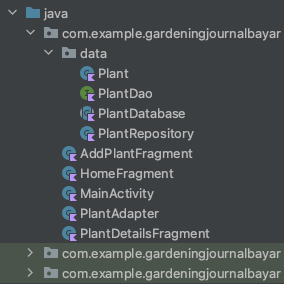
# 1. XML code
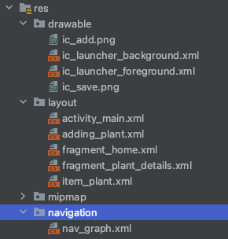
# Application Screen shots
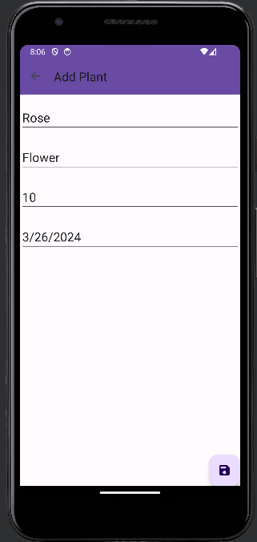
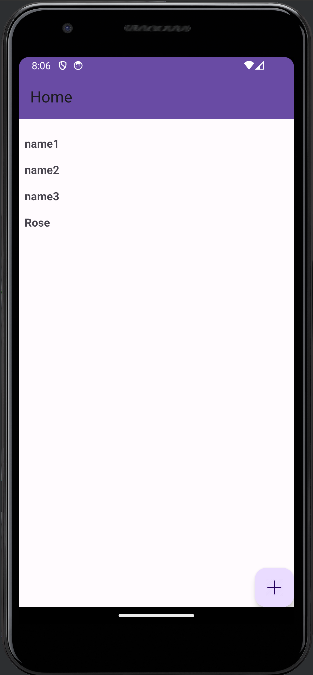
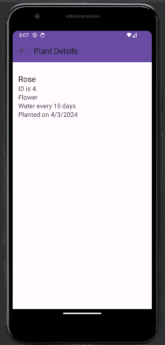
# Plant, PlantDao, PlantDatabase, PlantRepository
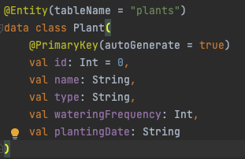
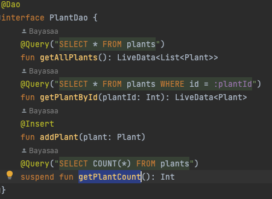
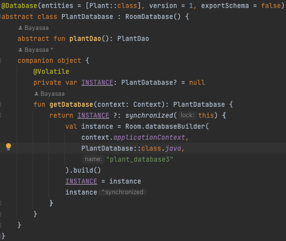
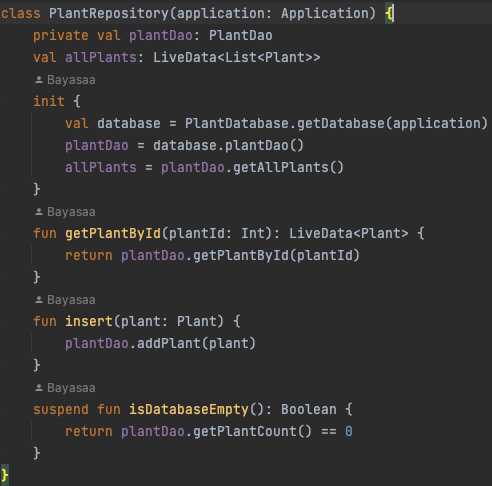
# HomeFragment
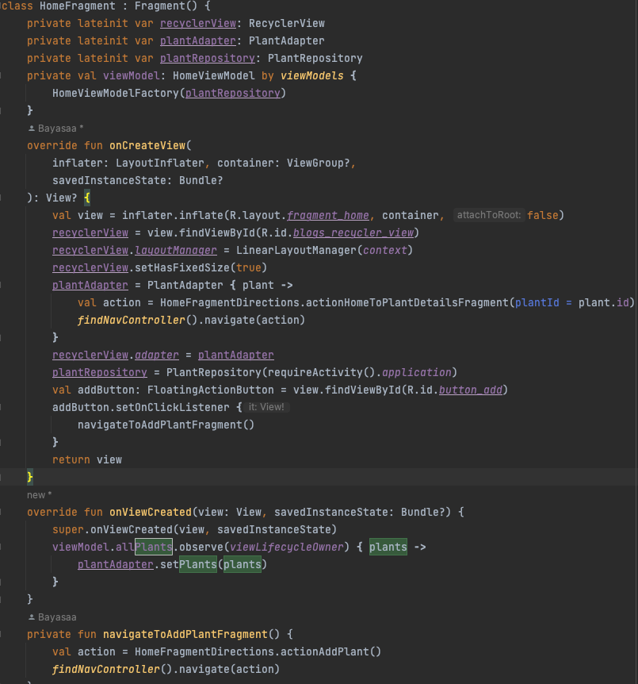
# AddPlantFragment
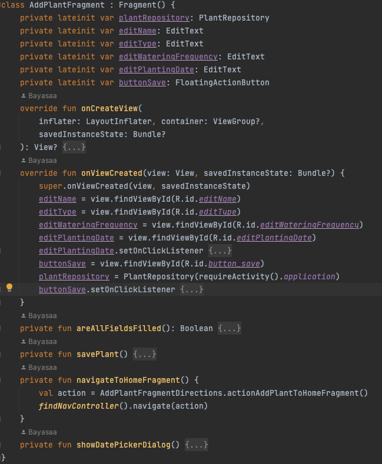
# MainActivity
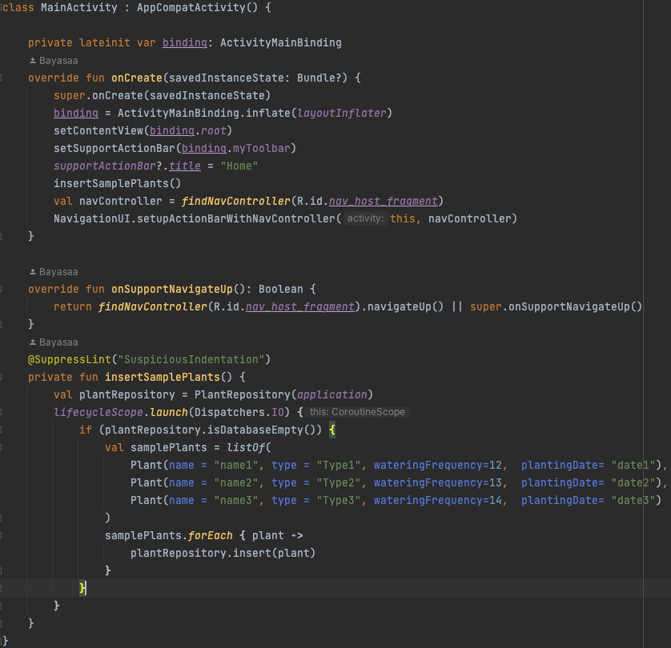
# PlantAdapter
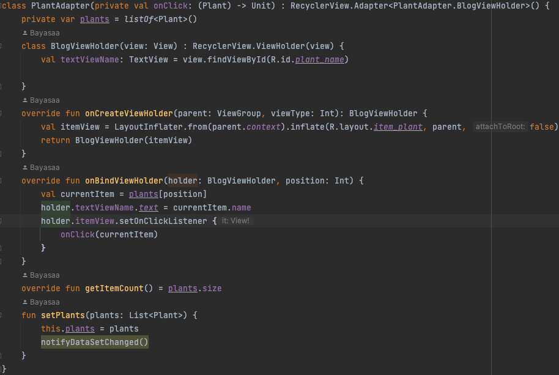
# PlantDetailsFragment
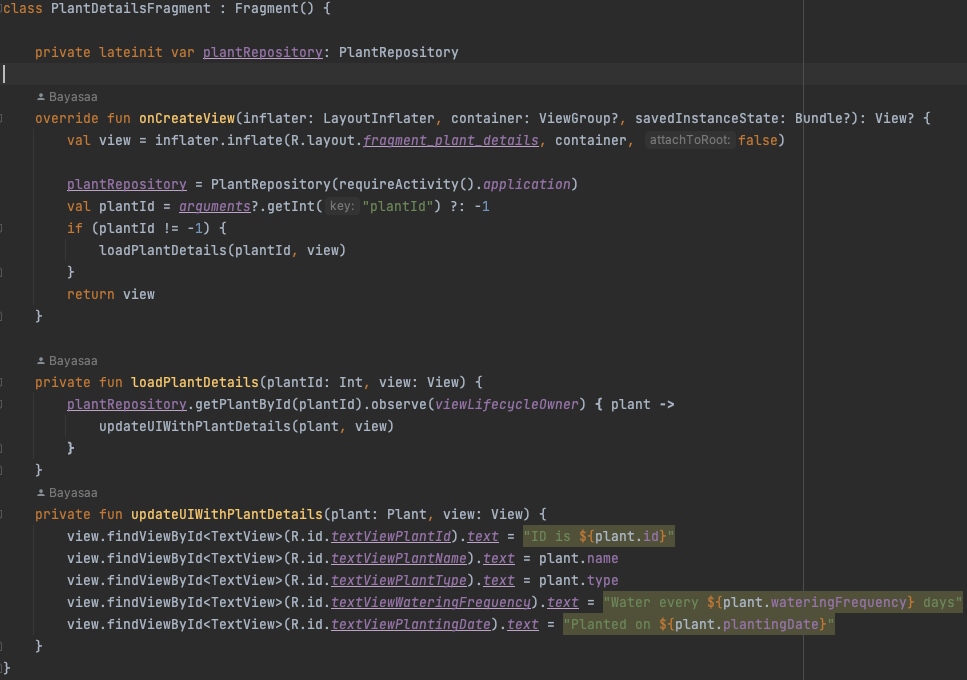
# res/navigation/nav_graph.xml
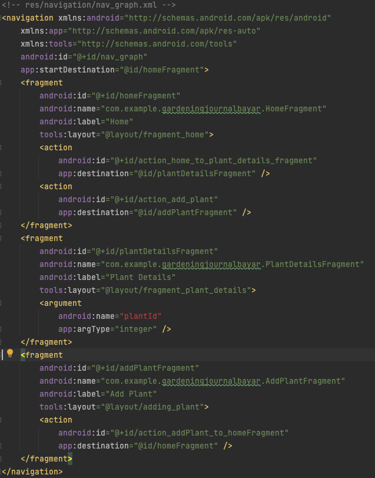
