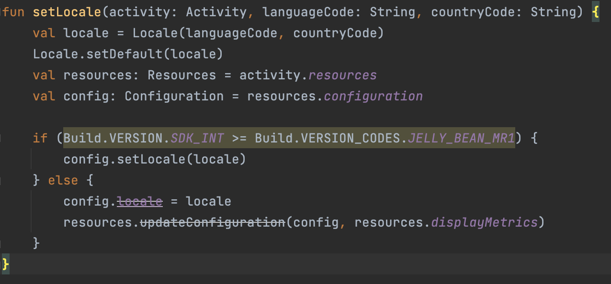
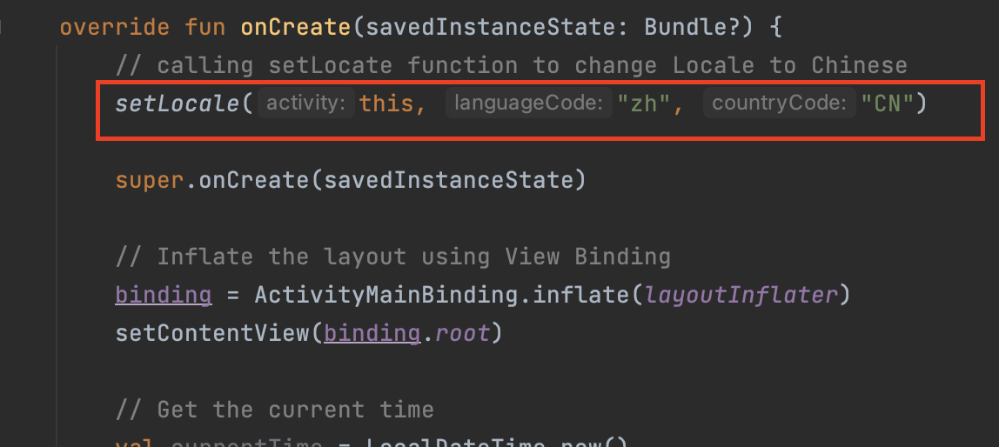
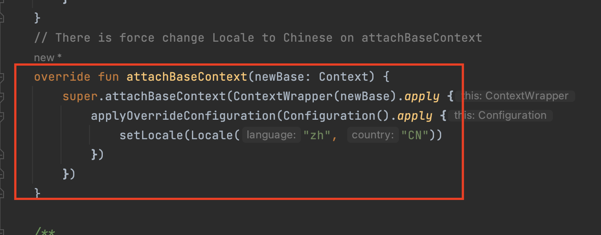
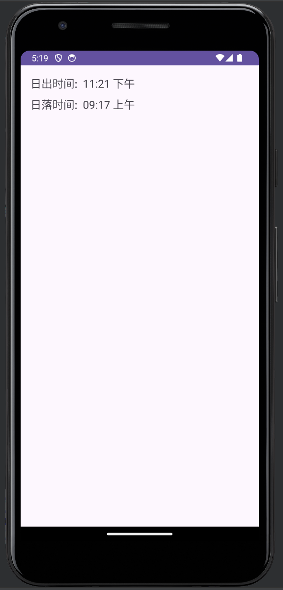

# Bayar Extra point APP
# Code structure
# 1. This function is force change Locale to Chinese

# 2. Calling setLocate function to change Locale to Chinese

# 3. Also, There is force change Locale to Chinese on attachBaseContext

# Application Screen Shot
